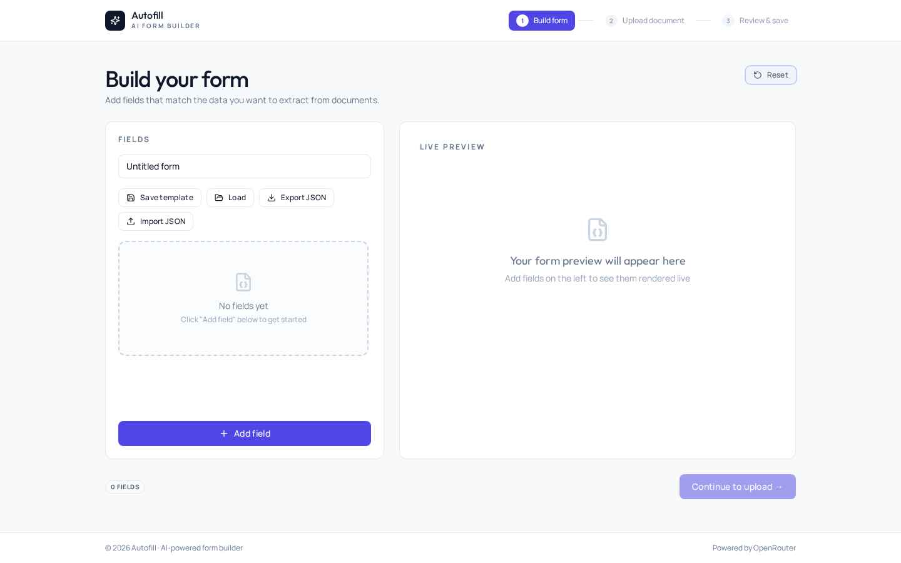
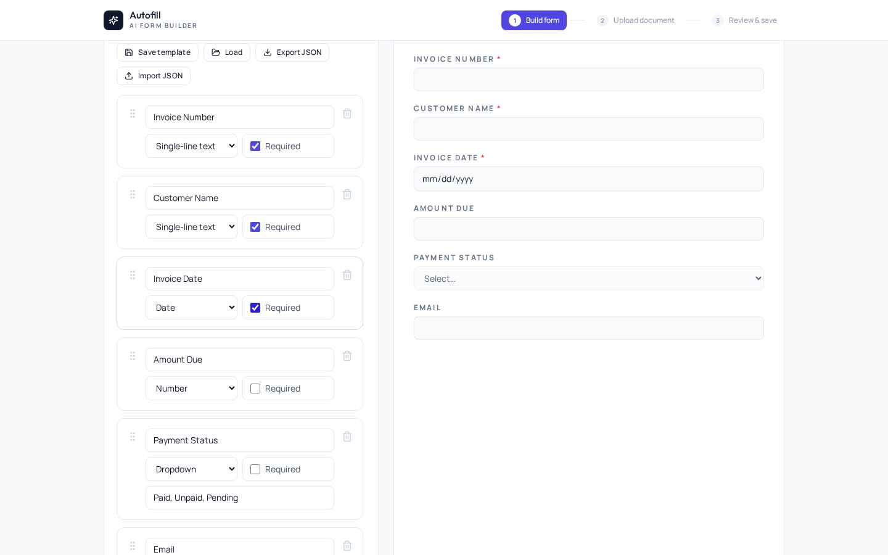
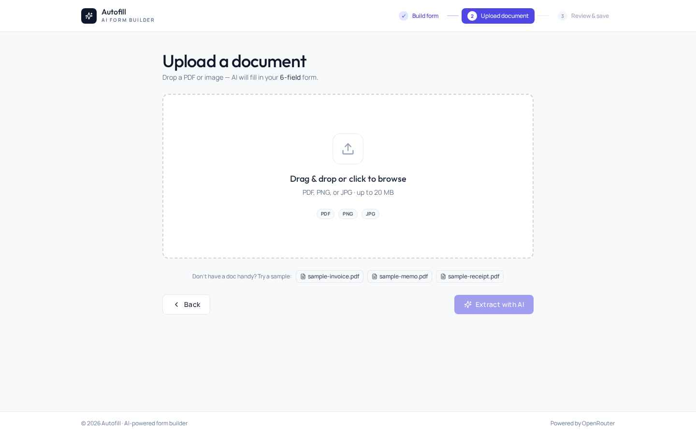
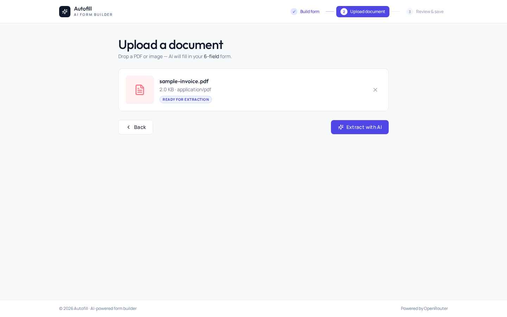
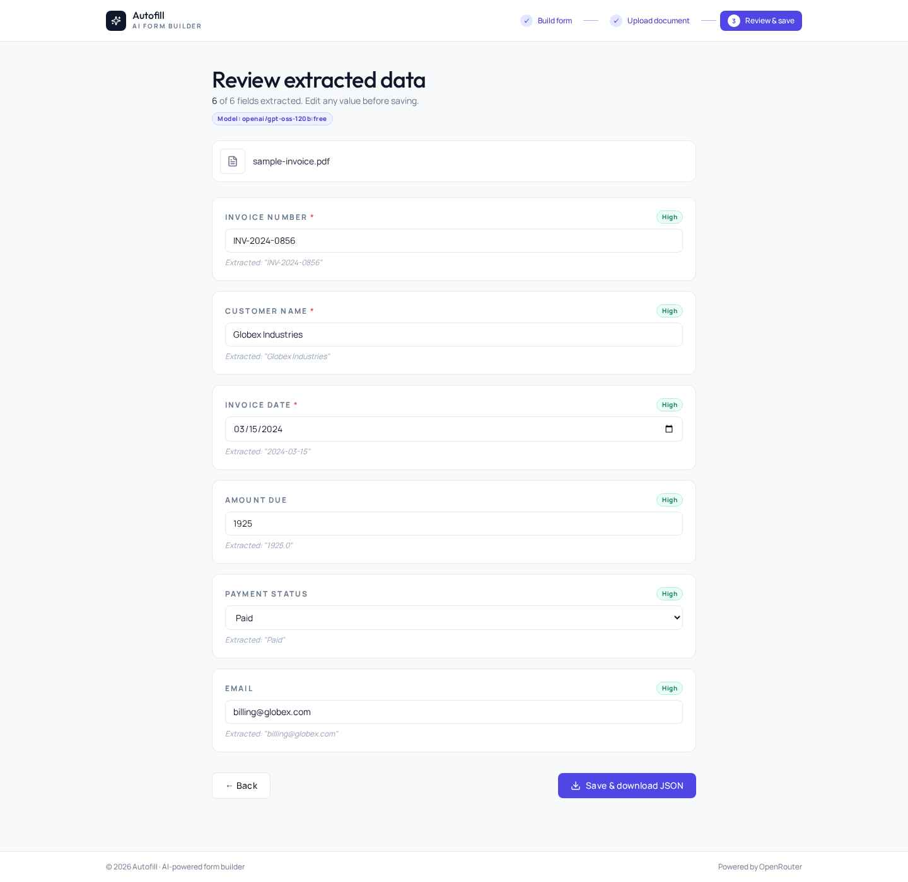
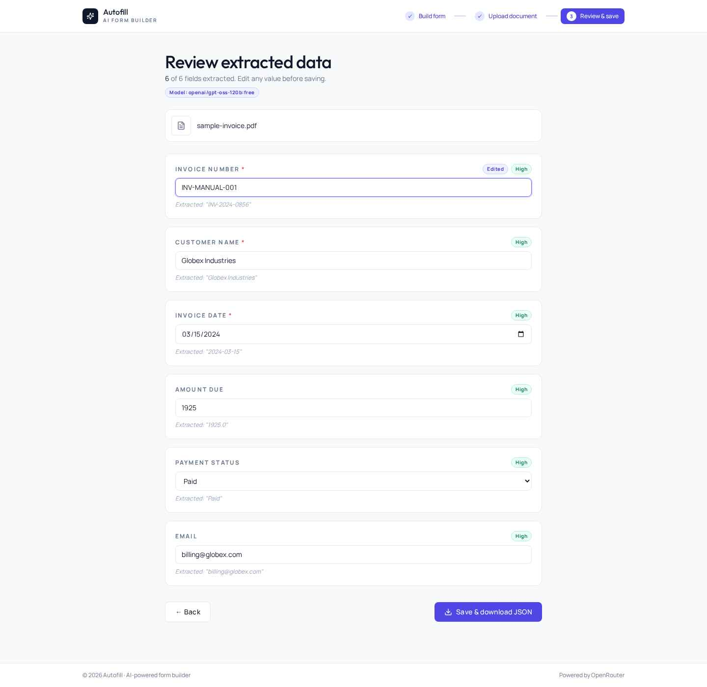
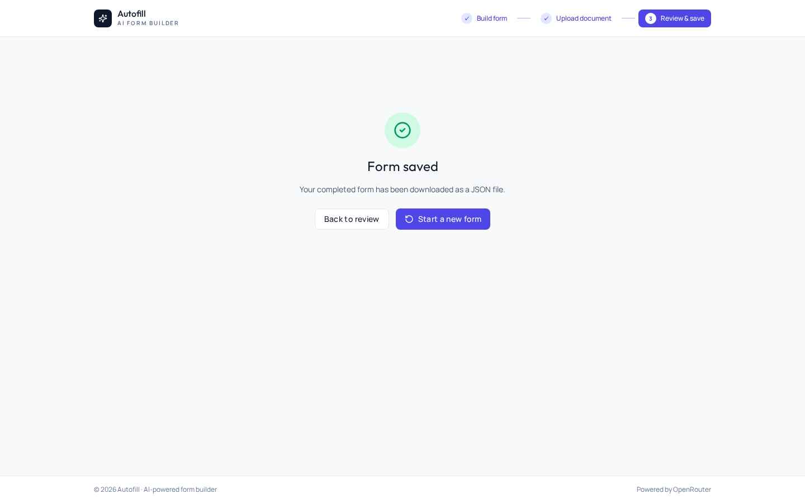
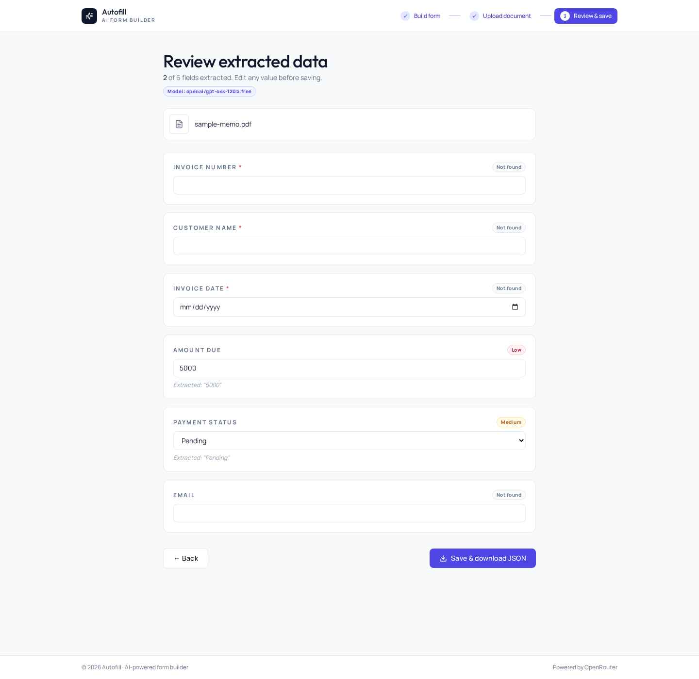

# Autofill — AI-Powered Form Builder & Document Autofill

A full-stack web app that lets users build custom forms at runtime, upload PDF / image documents, automatically extract field values with an LLM, review and edit the extracted data, and save the completed form as JSON.

---

## 📸 Demo / Screenshots

| Step | Screenshot |
| --- | --- |
| **1. Empty builder** — start with a blank canvas |  |
| **2. Form builder + live preview** — 6 fields configured with mixed types |  |
| **3. Upload dropzone** — with sample PDF links for quick testing |  |
| **4. File attached** — preview + "Ready for extraction" status |  |
| **5. Review with confidence badges** — every field rated by the LLM |  |
| **6. "Edited" badge** — appears next to the model's confidence when user changes a value |  |
| **7. Save success** — completed form downloaded as JSON |  |
| **8. Ambiguous document** — model honestly reports **Low / Not found** instead of guessing |  |

---

## 🛠 Technologies Used

| Layer | Choice | Why |
| --- | --- | --- |
| **Frontend framework** | React 18 (CRA) | Schema-driven UI, fast HMR |
| **Styling** | Tailwind CSS 3 + custom CSS animations | Utility-first, no runtime CSS-in-JS |
| **Fonts** | Outfit (display) + Manrope (body) + JetBrains Mono | Distinct, non-generic typography |
| **State management** | Zustand | 3 small stores: form / upload / extraction |
| **Drag & drop** | @dnd-kit/core + sortable | Accessible, keyboard-navigable reordering |
| **HTTP** | axios | File upload via multipart |
| **Icons** | lucide-react | Tree-shakeable, consistent 24-stroke icons |
| **IDs** | nanoid | Tiny URL-safe unique IDs for field keys |
| **Backend framework** | FastAPI (Python 3.11) | Async, fast, OpenAPI auto-docs |
| **PDF text extraction** | pdfplumber | Robust text-layer parsing |
| **Image OCR** | pytesseract + Tesseract 5 | Standard OSS OCR for scanned docs / images |
| **Image library** | Pillow | Format normalization before OCR |
| **LLM provider** | OpenRouter (single key → many models) | Configurable via `.env` |
| **Default LLM model** | `openai/gpt-oss-120b:free` | Fast, free, returns clean JSON; supports tool/JSON style replies |
| **Schema validation** | Pydantic v2 | Type-safe request/response models |
| **Persistence** | Browser localStorage | No DB required — schemas + templates live in browser |
| **Process supervision** | supervisord | Kept services running in dev container |

## Architecture

```
┌─────────────┐         POST /api/extract-fields         ┌──────────────┐
│   Browser   │  ────────────────────────────────────►   │   FastAPI    │
│  (React)    │      multipart: file + schema JSON       │   backend    │
└─────────────┘                                          └──────┬───────┘
       ▲                                                        │
       │ JSON: { results, model }                               ▼
       │                              ┌──────────────────────────────────┐
       │                              │ 1. pdfplumber / pytesseract OCR  │
       │                              │ 2. Build extraction prompt       │
       │                              │ 3. Call OpenRouter chat/completions│
       │                              │ 4. Parse + type-coerce + return  │
       │                              └──────────────────────────────────┘
```

The browser never sees the OpenRouter API key — all LLM calls are proxied through the backend.

---

## Setup

### Prerequisites
- Python 3.11+
- Node.js 18+ and Yarn
- Tesseract OCR (for image extraction): `apt-get install tesseract-ocr`
- An OpenRouter API key — get one at <https://openrouter.ai/keys>

### 1. Backend

```bash
cd backend
pip install -r requirements.txt
cp .env.example .env   # then edit
```

Edit `backend/.env`:

```ini
OPENROUTER_API_KEY=sk-or-v1-...
OPENROUTER_MODEL=openai/gpt-oss-120b:free
OPENROUTER_BASE_URL=https://openrouter.ai/api/v1
MONGO_URL=mongodb://localhost:27017   # unused currently, kept for future
DB_NAME=formautofill
```

Run:

```bash
uvicorn server:app --host 0.0.0.0 --port 8001 --reload
```

### 2. Frontend

```bash
cd frontend
yarn install
cp .env.example .env  # set REACT_APP_BACKEND_URL
yarn start
```

Edit `frontend/.env`:

```ini
REACT_APP_BACKEND_URL=http://localhost:8001
```

Open <http://localhost:3000>.

---

## How It Works

### Step 1 — Build your form
- Add fields with the **+ Add field** button
- Configure each field's label, type, required toggle, and (for dropdowns) options
- Drag the grip handle to reorder
- Live preview on the right updates instantly
- Toolbar: Save template, Load template, Export JSON schema, Import JSON schema

### Step 2 — Upload a document
- Drag & drop or click the dropzone
- Accepted: **PDF, PNG, JPG, JPEG** up to **20 MB**
- Uploading before creating a form is blocked with a clear error
- Validation: type, size, empty-file detection

### Step 3 — AI extraction
- The browser sends `file + schema` to `POST /api/extract-fields`
- Backend extracts text from the document (pdfplumber for PDFs, Tesseract OCR for images)
- Backend builds a structured prompt and calls OpenRouter
- The model returns each field as `{ value, confidence }`, where confidence is **`high` / `medium` / `low` / `none`** — the model self-rates how certain it is
- Backend type-coerces every value to the declared field type; if coercion fails or value is null, confidence is forced to `none`
- Uncertain values come back as `null` → shown as **"Not found"** in the UI

### Step 4 — Review & save
- All values editable in-place
- **Confidence badges** per field, **self-rated by the LLM**: `High` (green), `Medium` (amber), `Low` (rose), `Not found` (gray)
- An **`Edited`** badge appears next to the confidence badge when you manually change a value
- Required fields with no value are **highlighted in red** and saving is blocked until they're filled
- Click **Save & download JSON** to download the completed form as a JSON file

---

## API

All endpoints are under `/api`.

### `GET /api/health`
Returns the provider configuration:
```json
{
  "status": "ok",
  "app": "AI Form Autofill",
  "provider": "openrouter",
  "model": "openai/gpt-oss-120b:free",
  "key_configured": true
}
```

### `POST /api/extract-text`
Multipart: `file` (PDF/PNG/JPG). Returns the raw text extracted via pdfplumber/OCR:
```json
{
  "filename": "invoice.pdf",
  "content_type": "application/pdf",
  "char_count": 193,
  "text": "INVOICE #INV-2024-0856\nDate: 2024-03-15..."
}
```

### `POST /api/extract-fields`
Multipart: `file` + `schema` (JSON string). Returns extracted, type-coerced values with **LLM-rated confidence** per field:
```json
{
  "results": [
    { "field_id": "invno",   "value": "INV-2024-0856",    "confidence": "high",   "raw_text": "INV-2024-0856" },
    { "field_id": "amount",  "value": 5000,               "confidence": "medium", "raw_text": "5000" },
    { "field_id": "vat",     "value": null,               "confidence": "none",   "raw_text": null }
  ],
  "model": "openai/gpt-oss-120b:free",
  "document_length": 193
}
```
The model is prompted to return both `value` and a self-rated `confidence` ∈ {`high`, `medium`, `low`, `none`}. The backend overrides confidence to `none` if type coercion fails or the value is null.

---

## Switching the LLM Provider / Model

All AI configuration lives in `backend/.env`. To use a different OpenRouter model:

```ini
OPENROUTER_MODEL=anthropic/claude-3.5-haiku
# or any other model id from openrouter.ai/models
```

To use a different provider entirely (e.g. Nia, direct Anthropic), swap the call in `backend/server.py::call_openrouter` — it's the only function that talks to the provider, ~40 lines. Everything else is provider-agnostic.

---

## Bonus Features Included

| Feature | Status |
| --- | --- |
| Confidence indicators per field | ✅ **LLM self-rates each field** as High / Medium / Low / Not found; separate Edited badge when user modifies |
| Drag & drop field reordering | ✅ via @dnd-kit with keyboard accessibility |
| Save & load form templates | ✅ persisted in browser localStorage |
| Import / export JSON schema | ✅ download / upload schema JSON files |
| Real-time extraction updates | ⚠️ partial (loading state shown; not streaming) |

---

## Edge Cases Handled

| Scenario | Behaviour |
| --- | --- |
| Upload before form exists | Blocked with instructional error |
| Unsupported file type | Blocked client + server side |
| File > 20 MB | Blocked with size error |
| Empty / corrupted file | FileReader / pdfplumber error caught with friendly message |
| Missing API key | `key_configured: false` returned by health; extract returns 500 with clear message |
| LLM returns invalid JSON | Tries 2nd parse attempt (extract substring between first `{` and last `}`) |
| LLM returns empty / null content | 502 with hint to change `OPENROUTER_MODEL` |
| LLM rate-limited (429) | 502 with provider message |
| Type mismatch (e.g. "5th Jan" for date) | Coercion returns `null` → field left blank |
| Dropdown value not in options list | Left blank for user selection |
| Required field missing at save | Highlighted red, save blocked, auto-scroll to first missing |
| Network timeout (120 s) | Error state with Back button |
| Empty document (no text) | All fields returned `null`, no LLM call made |

---

## Assumptions

1. **Default LLM is text-only.** The chosen default (`openai/gpt-oss-120b:free`) does not accept image/PDF inputs natively. The backend converts documents to plain text first — pdfplumber for PDFs (text-layer extraction) and Tesseract OCR for image uploads. This means **OCR quality matters**: clean scans extract well, blurry photos less so. If you swap to a vision-capable model (`google/gemini-2.5-flash`, `anthropic/claude-3.5-sonnet`, etc.) you'd need to send the file bytes directly — currently not implemented since the chosen model is text-only.
2. **Short / single-page documents work best.** Long multi-page PDFs are sent in full and may exceed the model's context window with some providers. No pagination / chunking is implemented.
3. **localStorage persistence.** Form schemas, templates, and current draft live in the browser. Clearing site data clears everything. There is no backend submission history.
4. **`MONGO_URL` / `DB_NAME` are reserved but unused.** Scaffolded for a future "save submission history" feature.
5. **OpenRouter free-tier models are rate-limited per minute.** For production use, set `OPENROUTER_MODEL` to a paid model (e.g. `anthropic/claude-3.5-haiku`).
6. **Browser never sees the API key.** All LLM calls are proxied through the FastAPI backend.
7. **No auth.** The app is single-user / open. Adding multi-user would require backend persistence + auth (not in scope).
8. **Sample documents bundled.** Three sample PDFs (invoice / memo / receipt) ship in `frontend/public/samples/` for quick testing without needing real documents.

---

## Project Structure

```
/app
├── backend/
│   ├── server.py            # FastAPI app + OpenRouter integration
│   ├── requirements.txt
│   └── .env
├── frontend/
│   ├── src/
│   │   ├── App.js           # Wizard router + stepper
│   │   ├── components/
│   │   │   ├── BuilderStep.js   # Drag-drop builder + live preview + templates
│   │   │   ├── UploadStep.js    # Dropzone + extraction trigger
│   │   │   ├── ReviewStep.js    # Editable review + save
│   │   │   └── ui.js            # Button / Input / Card / Badge primitives
│   │   ├── store/index.js   # Zustand stores (form, upload, extraction)
│   │   ├── utils/helpers.js # File validation, JSON export
│   │   ├── App.css
│   │   ├── index.js
│   │   └── index.css        # Tailwind + animations
│   ├── public/index.html
│   ├── package.json
│   ├── tailwind.config.js
│   └── postcss.config.js
└── README.md
```

---

## License

MIT
